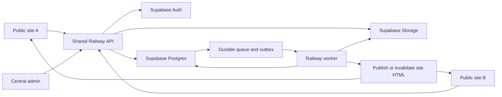

# Supabase and Railway implementation blueprint

Prepared: 28 September 2026. Status: proposed architecture, not an implemented backend or a ready-to-run migration. Read alongside [the AdSense and content plan](ADSENSE_SITE_PLAN.md). Product limits, retention periods, service choices, and rollout targets below are recommendations for this project; they are not Google approval requirements.

This plan uses one shared Railway API, Supabase Postgres/Auth/Storage, one central admin application, and several independently configured public sites. One codebase can serve several domains. Each distinct site still needs its own useful content, truthful policies, working tools, and any required advertising review. Neither this architecture nor a particular number of articles guarantees AdSense approval.

## 1. Existing repository and required corrections

The repository currently contains 12 HTML/JavaScript tools, six category pages, four static articles, trust/legal pages, a Python site generator, and an Express demo admin backend. Supabase clients exist in `lib/supabase.js`, but there are no database migrations, tenant boundaries, durable publishing jobs, or implemented content persistence.

| Current behavior | Required implementation |
| --- | --- |
| `server.js` trusts the literal cookie `admin_session=authenticated`. | Replace it with verified Supabase identity and revocable server sessions; check site membership and permission on every protected operation. |
| The demo has a fallback `admin123` password. Any successful Supabase login also becomes an admin. | Remove demo credentials and automatic admin access. Invite users into explicit site roles; bootstrap the first owner through a restricted setup process. |
| `PUT /api/tools/:slug` and `POST /api/posts` have no authorization. | Replace them with authenticated, tenant-scoped routes with validated schemas and database enforcement. |
| Tools/posts are mutated in `data/mockData.js`; reported traffic is sample data. | Persist content in Postgres and show clearly labeled real measurements. Never migrate invented analytics as production activity. |
| `express.static(siteRoot)` serves the repository root. | Publish only an explicit generated `public/` directory. Exclude server code, generator scripts, configuration, private docs, migrations, and dependencies. |
| `lib/supabase.js` is required before `dotenv.config()` runs. | Initialize and validate configuration before importing dependent modules; fail startup when required production settings are missing. |
| A shared Supabase auth client signs users in. | Isolate auth/session state per request. Keep any privileged client separate and never attach a visitor token to it. |
| Admin views render editable values through `innerHTML`. | Use safe text rendering and a reviewed rich-content sanitizer; enforce this when saving, publishing, and previewing content. |
| Temporary mail uses a provider integration without a complete token-based message flow; provider content is inserted into HTML unsafely. | Repair and test the provider flow, render mail as text or isolated sanitized content, and disclose actual provider retention. Keep the entire tool/mailbox route ad-free. |
| The password tool uses `Math.random()` despite a Web Crypto claim. | Use Web Crypto, unbiased selection, and tests that each selected character class is actually included. Never send passwords to the server. |
| The consent notice is only a dismissible `sessionStorage` banner. | Implement the consent requirements in the companion plan before enabling advertising or optional tracking. |

These are findings from the local files, not evidence that a production deployment was inspected. Nothing in this planning task fixes them yet.

## 2. Components and responsibility boundaries



| Component | Owns |
| --- | --- |
| Public frontend | Server-rendered or prebuilt page HTML, local tool execution, accessible controls, consent-aware scripts, per-site canonical URLs. |
| Central admin | Site switcher, editorial workflow, categories, tools, assets, domains, users, analytics, operational views, advertising configuration. |
| Railway API | Authentication, permissions, site resolution, validation, rate limits, public content API, admin API, upload authorizations, job submission, provider adapters. |
| Supabase Postgres | Durable records, constraints, RLS, transactional publication, outbox, jobs, queue, aggregate analytics. |
| Supabase Auth | Admin identities, login, recovery, MFA, session tokens. Public visitors do not need accounts for browser tools. |
| Supabase Storage | Published editorial images and private temporary uploads/results if server processing is enabled. |
| Railway worker | Durable publishing, cleanup, aggregation, notifications, optional heavy image/PDF work. Scale heavy processing separately from editorial jobs when enabled. |
| Scheduler | Enqueue due work and monitor overdue work. Choose one scheduler for each task. |
| Edge Functions | Optional short adapters; inventory in section 10. None is inherently necessary when Railway already provides the same operation. |

Preserve the current HTML approach initially: move generator inputs from hardcoded Python data to reviewed content snapshots fetched during builds. Publish atomic per-site build artifacts. Alternatively use a rendering framework with server rendering and caching. In both cases, headings, explanations, FAQs, navigation, and articles must be in the initial HTML; a browser-side fetch that fills an otherwise empty page is not the publication architecture.

## 3. Execution plan for all 12 tools

| Tool key | Default execution and persistence | Server responsibilities |
| --- | --- | --- |
| `temp-mail` | Provider integration; inbox/address credentials only for the active session. Do not store message bodies in analytics, content tables, or logs. | Provider adapter if needed, quotas, abuse handling, provider authentication, expiry/deletion attempts, outage reporting. Server proxying does not change provider terms or retention. |
| `background-remover` | Browser worker/model by default. Keep image bytes local. | Optional opt-in queued fallback after resource testing and disclosure. Model/license review and dependency/version management. |
| `pdf-merge` | Browser processing. Keep documents local. | Optional queued fallback for bounded files only; no need to upload routine merges. |
| `image-to-pdf` | Browser processing. Keep images local. | Optional queued fallback with the same private file pipeline. |
| `qr-code-generator` | Local generation; no storage of encoded payload. | Content and coarse success/failure counters only. |
| `password-generator` | Local Web Crypto only. Never persist, log, or transmit generated passwords. | No password-generation endpoint. |
| `word-counter` | Local text processing. | No user text endpoint. |
| `json-formatter` | Local parsing/formatting; avoid executing input. | No JSON input endpoint. |
| `base64-tool` | Local byte/text conversion; do not render decoded HTML as active markup. | No input/output endpoint. |
| `user-agent-generator` | Local generation for documented compatibility/testing use. | Versioned browser/platform presets, reviewed periodically. No evasion service. |
| `color-palette-generator` | Local generation. | Optional preset catalogue. |
| `unit-converter` | Local conversion with tested units and rounding. | Versioned formula catalogue if needed. Do not silently introduce financial/medical advice. |

Third-party script/model downloads still create network requests even where input processing is local. Verify actual traffic and disclose it accurately. Pin reviewed dependency versions; self-host suitable assets where licenses and deployment size permit. The shared server is useful for management and persistence without collecting every tool's input.

Public tool configuration includes `execution_mode`, `enabled`, limits, privacy explanation, fallback availability, and `ad_mode`. At launch, set the entire tool page to `ad_mode=off` for temporary mail, password generation, background removal, PDF merge, image-to-PDF, QR generation, word counting, JSON formatting, and Base64 conversion. These pages process private messages, credentials, text, files, or encoded values; advertising scripts must not load on those routes. All private output/upload routes remain ad-free. The three other tool pages still require the companion plan's placement and eligibility checks before enabling ads. Reassess any future change to these defaults deliberately rather than silently loading ads alongside private input.

## 4. Multiple domains and tenant isolation

### Site model

Use `sites.id` as the tenant key. A brand/content property gets one site. Its `www` and apex domains can be aliases of that site, with one canonical host. A genuinely separate brand gets another site row and its own content, categories, membership, analytics, public settings, and review status. Sharing a tool's implementation is fine; automatically copying the same editorial site across many domains is not the strategy.

Use one Supabase production project initially, with `site_id` on every tenant-owned row. Separate Supabase projects can be introduced later for stronger contractual isolation or substantially different workloads. Staging always uses a separate project and different secrets.

### Resolving the intended site

1. Public APIs use `/v1/sites/{site_key}/...`; `site_key` is a public routing identifier, never a secret or authorization credential.
2. On the shared API host, the HTTP `Host` identifies the API, not the frontend site. Validate the requested key against an active `sites` row.
3. For browser requests, normalize the exact `Origin` and check that it belongs to an active verified domain for that site. This catches wrong frontend configuration; it does not authenticate a user. Reject unexpected origins for browser write operations.
4. Server-rendered/build requests may have no `Origin`. Allow public reads deliberately. Protected build/export operations use a scoped service credential bound to a site; never substitute an untrusted `X-Site-ID` for authorization.
5. Admin requests explicitly select a site, then require a verified user and a current active membership for that same site. Do not derive admin privileges from the chosen domain.
6. If sites use same-origin reverse proxies, trust forwarded host headers only from the configured proxy path and known infrastructure. Ignore arbitrary client-supplied forwarded-host/tenant headers. Unknown hostnames fail closed.
7. Every cache key, database lookup, storage key, rate-limit bucket, idempotency key, job payload, and audit event carries the resolved `site_id`. Never key a content cache by slug alone.

### Domain onboarding and CORS

An owner adds a normalized hostname without paths, ports, wildcards, or credentials. Issue a random DNS TXT challenge, store its hash and expiry, and verify domain control before activation. Ensure hostname uniqueness across all sites. After DNS/TLS is configured on the frontend host, verify HTTPS, canonical redirects, sitemap, legal details, and public rendering. Railway supports public endpoints/custom domains for services; the frontend provider separately owns its domain configuration. [Railway public networking](https://docs.railway.com/networking/public-networking)

Allow only exact production HTTPS origins, with localhost entries in development configuration only. Return `Vary: Origin` whenever reflecting an allowed origin. Allow only necessary methods and headers. Never use `Access-Control-Allow-Origin: *` for a credentialed admin flow. CORS is a browser rule: clients can forge or omit `Origin`, so it cannot protect database rows or authenticate private jobs.

Use one central admin origin, preferably served with the admin API behind the same origin. The central API remains shared by all public domains. Avoid depending on third-party cookies across unrelated public domains. If admin cookies are used, make them `Secure`, `HttpOnly`, bounded in lifetime, and appropriate `SameSite`; add CSRF protection to every state-changing cookie-authenticated route.

Removal disables the domain immediately, clears origin/host caches, revokes its deployment credential, removes infrastructure mappings, and prevents dangling domain claims. Do not let a new site inherit another site's domain merely because DNS verification once succeeded.

## 5. Relational schema

### Conventions

- `uuid` identifiers use database-generated UUIDs; timestamps are `timestamptz` in UTC. Store a site's display timezone separately.
- Every tenant table has non-null `site_id REFERENCES sites(id)`. For an entity with an `id`, add `UNIQUE(site_id,id)` and make child references composite. A foreign key on `id` alone does not prevent cross-site associations.
- Use enums or explicit `CHECK` constraints for statuses/roles; positive-size/count checks; bounded strings and validated JSON schemas. JSON is for structured documents/configuration, not relational membership or permissions.
- Never trust client-provided `site_id`, actor IDs, publication timestamps, or status transitions. Assign them from verified context or controlled database routines.
- Tenant and entity IDs are immutable. Avoid blanket cascades for sites, memberships, content, or assets; deactivate first and use an audited deletion workflow. Cascades are appropriate only for disposable join rows after parent deletion is authorized.
- `created_by`/`updated_by` reference `auth.users(id)` and can become null on account deletion where history must remain. Public author identity is a separate editorial record.
- In the tables below, “site FK” means the composite `(site_id, referenced_id)` FK. Global `tool_catalog.key` and Supabase Auth user IDs are deliberate exceptions.

### Identity, sites, and configuration

| Table | Key columns | Required constraints / indexes |
| --- | --- | --- |
| `sites` | `id`, `site_key`, `name`, `status`, `locale`, `timezone`, `public_settings jsonb`, `publication_version`, `created_at`, `updated_at` | Unique normalized `site_key`; status `setup/active/paused/archived`; nonnegative publication version. No credentials in `public_settings`. |
| `site_domains` | `id`, `site_id`, `hostname`, `status`, `is_primary`, `challenge_hash`, `challenge_expires_at`, `verified_at` | Globally unique normalized hostname; partial unique `site_id WHERE is_primary AND status='active'`; only verified active domains can become primary. |
| `profiles` | `user_id`, `display_name`, `created_at` | PK/FK to `auth.users`; private admin profile only. Do not expose users' login emails through author pages. Omit private profile avatars initially. |
| `private.admin_sessions` | `id`, `session_token_hash`, `user_id`, `encrypted_refresh_token`, `expires_at`, `revoked_at`, `created_at` | Global Auth-user FK; unique token hash; non-exposed schema and server-only grants. Central-admin cookie contains the random opaque session secret, never the refresh token. Membership still determines site access. |
| `site_members` | `site_id`, `user_id`, `role`, `status`, `invited_by`, `created_at` | PK `(site_id,user_id)`; role `owner/admin/editor/analyst/viewer`; index `(user_id,status,site_id)`; no self-enrollment/self-promotion. |
| `member_invites` | `id`, `site_id`, `email_normalized`, `role`, `token_hash`, `expires_at`, `accepted_at`, `invited_by` | Unique token hash; one pending invite/site/email enforced transactionally or by partial unique index on pending status. Accept only through a verified matching account. |
| `site_integrations` | `id`, `site_id`, `provider`, `enabled`, `public_config`, `secret_reference`, `last_checked_at` | Unique `(site_id,provider)`; store a vault/environment reference, not a plaintext private key in public configuration. |
| `ad_units` | `id`, `site_id`, `placement_key`, `provider`, `publisher_id`, `unit_id`, `enabled`, `allowed_page_kinds` | Unique `(site_id,placement_key)`; allowlisted placements only. No arbitrary administrator-provided JavaScript snippets. Global kill switch takes precedence. |
| `private.site_ad_settings` | `site_id`, `ads_enabled`, `kill_switch`, `review_state`, `submitted_at`, `last_reviewed_at`, `review_notes`, `cmp_provider`, `cmp_config_version`, `updated_by`, `updated_at` | PK/FK to site; server-only writes; review state `not_submitted/pending/approved/needs_attention/disabled`; private review notes. Publish only the public configuration subset needed by the frontend. |

For advertising, store per-site administrative review state and evidence, but label it as internal tracking unless synchronized from an authorized official integration. A database flag cannot cause Google approval.

### Editorial content, tools, and categories

| Table | Key columns | Required constraints / indexes |
| --- | --- | --- |
| `tool_catalog` | `key`, `component_key`, `implementation_version`, `default_execution_mode` | Global PK `key`; seed exactly the 12 tool keys above. Deployed code owns executable components; admins edit configuration, not code. |
| `authors` | `id`, `site_id`, `slug`, `display_name`, `bio`, `credentials_text`, `avatar_asset_id`, `active` | Unique `(site_id,slug)`; avatar site FK to `media_assets`; publish only truthful supplied biographies. |
| `categories` | `id`, `site_id`, `slug`, `name`, `description`, `parent_id`, `landing_content_id`, `sort_order`, `active` | Unique `(site_id,slug)`; parent and landing content site FKs; prevent self-parenting/cycles; index `(site_id,active,sort_order)`. |
| `content_items` | `id`, `site_id`, `kind`, `workflow_status`, `working_revision_id`, `live_revision_id`, `scheduled_revision_id`, `scheduled_at`, `version`, `created_by`, `updated_at` | Kind `home/tool/category/article/about/contact/privacy/terms/cookies/disclaimer`; status `draft/review/scheduled/published/archived`; revision references include site and content ID; index `(site_id,workflow_status,updated_at)` and partial due-schedule index. |
| `content_revisions` | `id`, `site_id`, `content_id`, `revision_no`, `title`, `path`, `excerpt`, `body_doc jsonb`, `seo jsonb`, `created_by`, `created_at` | Immutable; unique `(site_id,content_id,revision_no)` and `(site_id,content_id,id)`; site FK to item; do not let draft edits change a live revision. `path` becomes uniquely reserved at publication, not across historical revisions. |
| `content_reviews` | `id`, `site_id`, `content_id`, `revision_id`, `reviewer_id`, `decision`, `notes`, `created_at` | Matching content/revision FK; decision `approved/changes_requested/rejected`; immutable review events; private notes; index `(site_id,revision_id,created_at)`. Publish checks a valid approval of that exact revision. |
| `public_pages` | `site_id`, `path`, `content_id`, `revision_id`, `site_active`, `is_live`, `rendered_html`, `public_data jsonb`, `canonical_url`, `published_at`, `updated_at`, `publication_version`, `indexable`, `ad_mode` | PK `(site_id,path)`; unique `(site_id,content_id)`; matching site/content/revision FK; sanitized public fields only. `site_active` maintained transactionally on site status changes. |
| `site_tools` | `site_id`, `tool_key`, `content_id`, `primary_category_id`, `enabled`, `execution_mode`, `limits jsonb`, `ad_mode`, `sort_order` | PK `(site_id,tool_key)`; catalog FK; content/category site FKs; unique `(site_id,content_id)`; allowed mode validated for each tool. |
| `content_authors` | `site_id`, `content_id`, `author_id`, `position` | PK `(site_id,content_id,author_id)`; content and author site FKs; unique position per content item. Snapshot visible bylines into a published revision. |
| `content_categories` | `site_id`, `content_id`, `category_id` | Composite PK; both parents use site FKs; reverse index `(site_id,category_id,content_id)`. |
| `tags` / `content_tags` | Tags: `id,site_id,slug,label`; join: `site_id,content_id,tag_id` | Unique tag slug/site; composite join PK and site FKs. Optional at launch; do not auto-publish empty tag pages. |
| `redirects` | `site_id`, `from_path`, `to_path`, `status_code`, `enabled` | PK `(site_id,from_path)`; allow 301/308; internal path destinations by default; reject loops/chains and collisions with live pages in the publication transaction. |
| `media_assets` | `id`, `site_id`, `bucket`, `object_key`, `mime_type`, `bytes`, `width`, `height`, `alt_text`, `license_source`, `status`, `created_by`, `created_at`, `deleted_at` | Unique `(bucket,object_key)`; positive bounded bytes/dimensions; object prefix must match site; status `pending/quarantined/ready/published/deleting/deleted`. |
| `content_assets` | `site_id`, `content_id`, `revision_id`, `asset_id`, `usage` | Composite PK; matching content/revision FK plus asset site FK; blocks deletion of live referenced images unless a replacement is published. |

Keep metadata inside revisions when it affects the publicly visible page: title, prose, headings, SEO fields, byline, source links, FAQ, disclosures, and canonical intent. Snapshot category labels/navigation used by a release or republish affected pages when those labels change. An admin dashboard should distinguish a saved draft, an approved revision, a published database snapshot, and the version actually served on the domain.

### Jobs, analytics, communications, and operations

| Table | Key columns | Required constraints / indexes |
| --- | --- | --- |
| `tool_jobs` | `id`, `site_id`, `tool_key`, `owner_user_id` nullable, `capability_hash` nullable, `actor_scope`, `status`, `idempotency_key`, `attempts`, `available_at`, `lease_token`, `lease_expires_at`, `error_code`, `created_at`, `expires_at` | Site/tool composite FK; unique `(site_id,actor_scope,idempotency_key)`; exactly one access model per job; status `awaiting_upload/queued/running/succeeded/failed/cancelled/expired`; indexes for ready jobs, leases, expiry. |
| `job_files` | `id`, `site_id`, `job_id`, `direction`, `bucket`, `object_key`, `mime_type`, `bytes`, `status`, `delete_after`, `expires_at`, `deleted_at` | Job site FK; unique `(bucket,object_key)`; direction `input/output`; private buckets only; explicit deletion states. |
| `mailbox_sessions` | `id`, `site_id`, `capability_hash`, `provider`, `provider_account_id`, `encrypted_credentials`, `expires_at`, `deletion_status` | Optional only if mail is proxied; unique capability hash; expiry index. No message bodies; no direct browser database access. Encryption key lives outside DB. |
| `contact_messages` | `id`, `site_id`, `name`, `reply_email`, `subject`, `message`, `status`, `created_at`, `delete_after` | Private; bounded plain text; index `(site_id,status,created_at)`; no default attachment support. |
| `analytics_events` | `id`, `site_id`, `event_id`, `received_at`, `event_name`, `route_key`, `tool_key` nullable, `duration_bucket` nullable, `result_code` nullable, `consent_mode` | Unique `(site_id,event_id)`; strict fixed schema; index `(site_id,received_at)`; retention partitioning later if needed. No arbitrary properties JSON. |
| `analytics_daily` | `site_id`, `day`, `metric`, `dimension_key`, `count`, `updated_at` | PK `(site_id,day,metric,dimension_key)`; recompute or increment with durable processing markers. Never invent unique-user counts from event counts. |
| `consent_receipts` | `id`, `site_id`, `receipt_id`, `policy_version`, `choices`, `recorded_at`, `expires_at` | Optional if the CMP/compliance design needs a local receipt; no full IP or cross-site visitor identity. Avoid duplicating unnecessary CMP data. |
| `outbox_events` | `id`, `site_id`, `event_type`, `aggregate_id`, `aggregate_version`, `payload`, `status`, `attempts`, `next_attempt_at`, `lease_expires_at`, `created_at` | Unique `(site_id,event_type,aggregate_id,aggregate_version)`; partial ready-work index; payload references records, never uploads, inboxes, secrets, or generated passwords. |
| `idempotency_records` | `site_id`, `actor_scope`, `operation`, `key_hash`, `request_hash`, `resource_id`, `status`, `expires_at` | Composite PK over site/actor/operation/key; same key with different request hash returns conflict. Never retain sensitive request bodies for replay. |
| `webhook_receipts` | `id`, `site_id`, `provider`, `external_event_id`, `payload_hash`, `received_at`, `processed_at`, `status` | Unique `(provider,external_event_id)` where provider IDs are globally scoped; otherwise include provider account ID. Resolve site from a trusted integration, not unsigned payload claims. |
| `audit_log` | `id`, `site_id`, `actor_user_id`, `action`, `entity_type`, `entity_id`, `request_id`, `redacted_change`, `created_at` | Append-only through controlled routines; index `(site_id,created_at)` and entity history; exclude secrets and private tool values. |
| `deployment_runs` | `id`, `site_id`, `publication_version`, `target`, `status`, `artifact_hash`, `started_at`, `finished_at`, `error_code` | Unique `(site_id,target,publication_version)`; track retryable build/deploy/purge failures separately. |

Supabase Auth and Storage own `auth.*` and `storage.*`; do not recreate their managed tables. Use Supabase Queues for durable messages, or a deliberately implemented leased Postgres queue. This blueprint selects Supabase Queues plus `tool_jobs` for user-visible state and `outbox_events` for transactional side effects. The queue's visibility window does not make external effects exactly once; consumers must handle redelivery. [Supabase Queues](https://supabase.com/docs/guides/queues)

### Foreign-key and index excerpt

This is an illustrative migration fragment against the tables above, **not a complete SQL migration to paste into production**. The implementation must create tables in dependency order, then add circular revision/category references and all policies/grants. Use the same pattern on every tenant relationship.

```sql
-- Parent uniqueness must exist before composite child references are added.
alter table public.categories
  add constraint categories_site_id_id_key unique (site_id, id);
alter table public.content_items
  add constraint content_items_site_id_id_key unique (site_id, id);
alter table public.content_revisions
  add constraint revisions_site_content_id_key
  unique (site_id, content_id, id);

alter table public.content_revisions
  add constraint revisions_content_fk
  foreign key (site_id, content_id)
  references public.content_items (site_id, id) on delete restrict;

alter table public.content_items
  add constraint content_live_revision_fk
  foreign key (site_id, id, live_revision_id)
  references public.content_revisions (site_id, content_id, id)
  deferrable initially deferred;

alter table public.content_categories
  add constraint content_categories_content_fk
  foreign key (site_id, content_id)
  references public.content_items (site_id, id) on delete cascade,
  add constraint content_categories_category_fk
  foreign key (site_id, category_id)
  references public.categories (site_id, id) on delete restrict;

create index content_categories_category_lookup
  on public.content_categories (site_id, category_id, content_id);
create index due_content_schedule
  on public.content_items (scheduled_at, site_id)
  where workflow_status = 'scheduled';
create index tool_jobs_expiry
  on public.tool_jobs (expires_at)
  where status <> 'expired';
```

Add the same matching-content constraint to `working_revision_id`, `scheduled_revision_id`, `public_pages`, and `content_assets`. Add a trigger or restricted publication routine for semantic checks that an FK cannot express: a site's tool must reference a `kind='tool'` item, a category landing must be `kind='category'`, paths must not collide with redirects, and the final owner cannot be removed. Validate scheduled timestamps and store the scheduled revision explicitly so later draft edits are not accidentally published.

## 6. Authentication, authorization, and RLS

### Access model

| Caller | Allowed access |
| --- | --- |
| Anonymous reader | Sanitized live public pages and public configuration only. Public data for all active sites is intentionally public; a site key is not a confidentiality barrier. |
| Anonymous tool visitor | Local execution; optionally create a bounded private job and use its unguessable capability token to access only that job. No direct private table grants. |
| Viewer | Read selected site's editorial/admin overview; exclude contact messages, integration secrets, raw visitor data, and mailbox/file contents. |
| Analyst | Read selected site's aggregated reports; no content writes or raw tool inputs. |
| Editor | Create revisions, edit categories, upload editorial media, preview and request review; no membership, domains, secrets, or publishing privileges by default. |
| Admin | Review/publish/archive content, manage tools/categories and contact inbox, operational reports; sensitive settings can require fresh MFA. |
| Owner | Admin abilities plus domain/integration/member management and audited site deletion/export. Cannot remove the final active owner. |
| Worker/system | Only its approved queue/database/storage operations; no user-selected unrestricted SQL or arbitrary URLs. |

Validate access tokens through Supabase verification facilities or a maintained JWT library against the project's signing keys; check signature, expiry, issuer, audience, and user identity. Never authorize from a decoded-but-unverified JWT or an editable user-metadata `role`. Membership is checked against current database state, so removing a site membership removes application access even if a JWT has not expired. Require MFA for admin/owner accounts and check assurance for sensitive writes. Use server-validated sessions and protect refresh tokens. [Supabase JWT verification](https://supabase.com/docs/guides/auth/jwts)

For the recommended central admin, use an opaque cookie linked to `private.admin_sessions`. Check revocation and expiry on each request, decrypt refresh credentials only on the server, rotate the session after login/security changes, and revoke the local session on logout. Forward a currently verified Supabase user access token to user-scoped database operations. Serialize refresh updates so parallel requests do not race token rotation. Keep token encryption keys outside the database and retain old key versions only for a bounded rotation window. A local logout should invalidate local cookies immediately; do not assume that a previously issued JWT disappears before its expiry.

Keep production Auth redirect URLs explicit and narrow; enable only the central admin login/recovery destinations. Disable public admin signup or leave all new users without site privileges until invited. [Supabase Auth redirect configuration](https://supabase.com/docs/guides/auth/redirect-urls)

For new work use current publishable/secret API keys where supported. The publishable key is public application identification, not tenant authentication. Secret keys and legacy service-role keys bypass RLS and must remain on trusted servers. Normal admin reads/writes should use the verified user's token, with RLS; use elevated clients only for narrowly defined system operations after authorization. [Supabase API keys](https://supabase.com/docs/guides/getting-started/api-keys)

### Database enforcement

Enable RLS on every exposed table, explicitly revoke default grants, and grant only intended operations. For operational tables not accessed via the Data API, use a non-exposed schema and restricted worker roles. Membership helpers belong in a non-exposed `private` schema. An elevated function must use a fixed `search_path`, fully qualified names, narrowly granted `EXECUTE`, and validate the caller. Avoid recursion between membership policies. Public views require deliberate invoker security or equivalent protection. [Supabase RLS and grants](https://supabase.com/docs/guides/database/postgres/row-level-security)

Example excerpts, not the complete policy set:

```sql
create schema if not exists private;

-- Create under a controlled migration owner that can read site_members
-- without recursively invoking that table's own membership policy.
create function private.has_site_role(p_site uuid, p_roles text[])
returns boolean
language sql stable security definer
set search_path = ''
as $$
  select exists (
    select 1
    from public.site_members m
    where m.site_id = p_site
      and m.user_id = (select auth.uid())
      and m.status = 'active'
      and m.role::text = any (p_roles)
  );
$$;

revoke all on function private.has_site_role(uuid, text[]) from public;
grant usage on schema private to authenticated;
grant execute on function private.has_site_role(uuid, text[]) to authenticated;

alter table public.categories enable row level security;
revoke all on public.categories from anon, authenticated;
grant select, insert on public.categories to authenticated;
grant update (slug, name, description, sort_order, active)
  on public.categories to authenticated;

create policy categories_member_read on public.categories
for select to authenticated
using (private.has_site_role(site_id, array['owner','admin','editor','viewer']));

create policy categories_editor_insert on public.categories
for insert to authenticated
with check (private.has_site_role(site_id, array['owner','admin','editor']));

create policy categories_editor_update on public.categories
for update to authenticated
using (private.has_site_role(site_id, array['owner','admin','editor']))
with check (private.has_site_role(site_id, array['owner','admin','editor']));

-- No direct DELETE grant. Re-parenting/removal goes through a checked routine.
-- The column UPDATE grant also prevents changing site_id or id.

alter table public.public_pages enable row level security;
revoke all on public.public_pages from anon, authenticated;
grant select on public.public_pages to anon, authenticated;
create policy public_live_pages on public.public_pages
for select to anon, authenticated
using (site_active and is_live);
```

`public_pages` contains public material only, including no drafts, reviewer notes, emails, service configuration, or private analytics. Its anonymous policy intentionally does not use the request hostname. Update `site_active` and public visibility in the same controlled transaction when pausing a site; invalidate public caches as an audited event.

Use controlled database routines for publish/unpublish, invite acceptance, membership changes, scheduled state changes, and job transitions. Deny direct writes that bypass those routines. Routines accepting a tenant ID must independently enforce membership; never accept an arbitrary caller-supplied actor UUID as proof. Pin elevated routine owners and grants in migrations, and forbid self-promotion and cross-site IDs at database level as well as the API.

For workers using secret/service-role access, RLS cannot save an unscoped query. Prefer restricted database roles with only needed routines/table grants, and enforce site checks inside routines. Where Storage requires elevated access, create isolated server clients and derive object paths from database records. Do not create a generic admin proxy that exposes arbitrary table names, filters, SQL, or RPC names.

## 7. API and admin feature contract

Use versioned JSON routes and a checked request schema for every write. Return consistent `{error:{code,message,request_id}}` errors without internal stack traces or provider secrets. Use pagination, bounded filters, UTC timestamps, and optimistic concurrency (`version`/`If-Match`) on edits.

| Routes (illustrative) | Requirements |
| --- | --- |
| `GET /v1/sites/{key}/config`, `/tools`, `/categories`, `/pages?path=...`, `/articles` | Published data only, bounded pagination, ETags, correct site-specific cache keys. |
| `POST /v1/sites/{key}/contact` | Plain-text validation, size limits, spam controls, rate limits, minimal retention; send notification through an outbox event. |
| `POST /v1/sites/{key}/events` | Strict event allowlist and consent handling; deduplication; does not count arbitrary client values as trusted business facts. |
| `POST /v1/sites/{key}/jobs`, `POST .../jobs/{id}/uploads`, `POST .../jobs/{id}/complete-upload` | Optional server processing; quotas; idempotency; generate server-owned private object keys; authorize each step. |
| `GET/DELETE /v1/sites/{key}/jobs/{id}`, `POST .../jobs/{id}/download` | Verified owner or capability token, matching site, expiry, no caching, short-lived download authorization. Return 404 where appropriate to avoid revealing other jobs. |
| `POST/GET/DELETE /v1/sites/{key}/mailboxes/...` | Only if provider proxy is chosen; private capability/session access, no ad scripts, no content logs, strict provider quotas. |
| `GET /v1/admin/sites`, `GET /v1/admin/sites/{id}/overview` | Verified identity; memberships; genuine metrics and publication status. |
| `POST/PATCH /v1/admin/sites/{id}/content`, `/content/{contentId}/revisions` | Draft creation/editing, validated rich text, optimistic concurrency, revision history and audit. |
| `POST .../content/{contentId}/review`, `/publish`, `/schedule`, `/unpublish`, `/restore` | Checked role and MFA when appropriate; immutable revision selected; atomic publication/outbox; preview and rollback support. |
| `GET/POST/PATCH .../categories`, `/authors`, `/tags`, `/tools`, `/media` | Site isolation, safe asset ingestion, category cycle checks, explicit tool availability/processing settings. |
| `GET/PATCH .../settings`, `/ads`, `/integrations`, `/domains`, `/members` | Owner/admin permission per operation, masked secrets, no arbitrary scripts, audit; domain verification and member invitation workflows. |
| `GET .../analytics`, `/audit`, `/jobs`, `/deployments`, `/contact` | Role-specific fields, exports scoped to site, no raw user files or inbox viewing by default. |
| `POST /v1/webhooks/{provider}` | Raw-body signature verification, replay window, event dedupe, trusted provider-account-to-site mapping. |
| `GET /health/live`, `/health/ready` | Minimal status only; no secret configuration or tenant data. |

Admin modules should include a real role-sensitive dashboard; article/page editor with preview; category/author management; tool catalogue and availability; media library with rights/alt text; navigation/footer editing; real contact inbox; members/MFA status; domains and canonical settings; redirects; consent/ad controls; aggregated analytics; publication/revalidation status; job failures/retries; and audit/export/deletion workflows. Settings that change public claims or legal disclosures require a publication revision.

Keep the central admin and all preview/draft/private job pages out of public sitemaps. Authentication is the protection for private data; `noindex` and `robots.txt` are indexing controls, not access controls.

## 8. Publication, queue, and scheduling reliability

### Content publication

1. Editor saves an immutable working revision and requests review. Preview uses short-lived, scoped authorization, returns `noindex`, and never appears in the public content API.
2. An authorized reviewer selects the exact revision, checks required fields and links, and publishes now or schedules that revision in UTC.
3. A database transaction locks the item, verifies the expected version, validates ownership of all referenced authors/categories/assets, updates the live snapshot/path/redirects, increments the site's publication version, and writes `content.published` to the outbox. Unpublish and legal-page changes use the same model.
4. An outbox dispatcher delivers the event to the queue. Retries use the event ID; enqueue duplication is harmless because downstream effects are idempotent.
5. Worker builds/revalidates the affected page, homepage listings, categories, relevant internal links, sitemap and feed. Domain configuration changes also update canonical URLs and root verification files where appropriate.
6. Deploy the complete site artifact atomically, or invalidate server-rendered caches by site/version. Mark `deployment_runs` successful only after a live fetch shows the expected publication version.
7. Show “saved,” “published in database,” “deploying,” or “live” accurately in the admin. A failed build must preserve the previous good artifact and leave a visible retryable failure.

Use publication version checks so an older delayed event cannot overwrite a newer build. Keep an approved rollback artifact and release history. Delete/unpublish events must remove cached content and sitemap entries, not merely change a database flag. For urgent removal, provide a site/path denial layer and cache purge rather than waiting only for the next full build.

### Scheduling and work ownership

Choose Supabase Cron to invoke small database routines that mark/enqueue due publications and retention tasks. Alternatively, use Railway Cron for the same responsibility; do not enable both schedules for the same job. Supabase Cron schedules database work; keep jobs bounded. Railway scheduled processes must exit and close connections, and a still-running prior execution causes the next run to be skipped. Build catch-up queries for all overdue rows, not only timestamps in the current minute. [Supabase Cron](https://supabase.com/docs/guides/cron), [Railway Cron behavior](https://docs.railway.com/cron-jobs)

Consumers claim work with a lease/visibility timeout, extend leases only while progressing, record attempts, use exponential retry with jitter, and move exhausted work to a dead-letter state for review. Recover expired leases. Cap per-site concurrency so one site cannot starve others. Queue messages contain IDs and versions; workers reload the authoritative row and recheck the site/tool is active before processing.

For a tool job, claiming a queue message also acquires a database processing lease with a new random `lease_token`. Complete/heartbeat/fail updates must match that token and the expected state, preventing an old timed-out worker from overwriting a newer attempt. Create the job and its outbox event in one database transaction. Repeated messages finding a terminal job acknowledge without processing again.

Use idempotency for publish, job submission, provider requests, contact notifications, analytics aggregation, cleanup, and deployment callbacks. A timeout does not prove a side effect failed. Reconcile external state before retrying actions where duplicate execution matters.

## 9. Storage and optional heavy processing

### Buckets and safe handling

| Bucket | Visibility | Contents |
| --- | --- | --- |
| `editorial-drafts` | Private | Quarantined and unpublished editorial media; short-lived preview URLs. |
| `editorial-public` | Public | Approved published images only. Public bucket objects are genuinely public. |
| `tool-inputs` | Private | Temporary opt-in server-processing inputs. |
| `tool-results` | Private | Temporary generated outputs. |

Use server-generated paths such as `{site_uuid}/{job_uuid}/{random_uuid}.pdf`; never use an original filename as the access boundary or storage key. Store only a sanitized filename if the UX needs it. Authorize signed URLs from trusted rows, with short expiry, exact object scope and allowed operation. Signed URLs are bearer access; keep them out of logs, referrers, analytics, screenshots, and public markup. Supabase Storage access is controlled through policies, while public buckets deliberately allow public retrieval. [Storage access control](https://supabase.com/docs/guides/storage/security/access-control), [bucket visibility](https://supabase.com/docs/guides/storage/buckets/fundamentals)

Set bucket-level MIME/size restrictions as well as application limits. Verify magic bytes, extension/type consistency, decoded pixel count, page count, encryption support, parser resource use, and the completed object's actual size before queueing. Do not assume browser validation or a signed upload token enforces all application limits. Quarantine uploads, reject active HTML/SVG by default, strip image metadata where suitable, and never fetch arbitrary user URLs. [Supabase file limits](https://supabase.com/docs/guides/storage/uploads/file-limits)

Initial application caps to benchmark: images at most 10 MB and 20 megapixels; PDF input at most 20 MB/file, 10 files, 50 MB total and 200 pages/job; at most two concurrent jobs per session and a measured per-site daily quota. Reject unsupported/password-protected PDFs clearly. Tune after load tests; these are product choices, not provider guarantees. Add reverse-proxy body limits, upload timeouts, signed-upload quotas, and per-session/site/IP abuse controls. Use IPs transiently for security controls with limited retention, separate from editorial analytics.

Anonymous job access uses a cryptographically random capability of at least 256 bits. Store its hash, return the secret once, and send it in an authorization header rather than a URL. Bind it to one job/site and expiry; rate-limit attempts. Persist in memory by default; explain if tab-scoped storage is used. A random job UUID alone is not sufficient authorization. User-account jobs instead require a verified owner. Never let an administrator browse private user files merely because they manage the site.

Scope submission idempotency to an authenticated user or a server-issued, short-lived anonymous submission-session token. Derive `actor_scope` from verified context; never accept a freely chosen actor ID. A repeated key from another visitor must not reveal or take ownership of an existing job, capability, or upload URL. These session tokens authorize only bounded job creation, not admin access.

### Workers and deletion

Keep CPU-intensive background removal and complex PDF processing on a Railway worker/container with explicit CPU, memory, file, subprocess and wall-time limits. Run parsers without shell-interpolated arguments, use isolated per-job temporary directories, restrict outbound networking, maintain patched dependencies, and terminate resource-exhausting jobs. Persistent state and outputs go to Supabase; local worker disk is scratch space only.

Supabase's hosted Edge Functions currently document 256 MB memory and 2 seconds of CPU per request, with separate wall-clock limits. Their background tasks remain bounded by those limits. They are unsuitable as the primary heavy PDF/image execution engine here. Recheck limits before deployment. [Edge Function limits](https://supabase.com/docs/guides/functions/limits), [background task limits](https://supabase.com/docs/guides/functions/background-tasks)

Suggested retention target: remove input/output objects by the earlier of one hour after a terminal job state or 24 hours after upload. Account for the 15-minute cleanup cycle inside that target: set `delete_after` 15 minutes before `expires_at` and begin deletion when eligible. Explain that files may expire earlier within this cleanup window. Revoke app access immediately on user deletion, pending deletion, or expiry. Report/alert on failed or overdue physical deletions rather than promising guaranteed timing; retry failures and reconcile orphaned objects against database records. Stop issuing URLs for pending deletion and cap each signed URL at the earlier of its short lifetime or the start of the deletion window. Existing links are bearer credentials, so remove bytes promptly and keep their maximum lifetime short.

Delete bytes through the Supabase Storage API, then mark metadata deletion complete. Direct SQL deletion from `storage.objects` does not delete stored bytes. Use a two-step deletion state with retry rather than claiming success before object removal. Do the same for editorial assets after confirming there are no live references. [Supabase object deletion](https://supabase.com/docs/guides/storage/management/delete-objects)

The final privacy policy must state the retention actually enforced and disclose provider/backups limitations. A tab close cannot reliably trigger server/provider deletion; use expiry plus an explicit delete endpoint, never a guaranteed “deleted when you close” claim.

## 10. Edge Function inventory

The system needs the capabilities below, but **zero Edge Functions are mandatory in the recommended Railway-first deployment**. This avoids operating two competing admin APIs. If a function is selected, designate it as the sole transport/owner for that operation and call shared database routines; do not copy permission logic into an independently evolving second backend.

| Function name | Default / when to use | Authorization and work |
| --- | --- | --- |
| `webhook-ingest` | Optional alternative to Railway webhook endpoint. | Verify provider signature on raw body and replay timestamp; dedupe; map trusted integration to site; enqueue and return quickly. |
| `dispatch-outbox` | Optional if moving the short queue dispatcher near the database. | Dedicated service credential; claim bounded batches, enqueue event IDs, mark delivered; retries and leases. |
| `publish-due` | Usually unnecessary: Cron calls the checked SQL routine directly. | If used, service-only; enqueue due approved revisions. Does not render large sites itself. |
| `retention-sweep` | Optional replacement for Railway cleanup worker. | Service-only; bounded Storage API deletion batches with continuation/retry. Must not silently stop at function timeout. |
| `analytics-ingest` | Optional replacement for the public Railway event endpoint. | Public but rate-limited and schema-validated; consent handling; no user input payloads. |
| `notify-contact` | Optional short email-provider adapter. | Queue/service-only; accepts a message ID, rechecks site, templates escaped text, stores delivery state. |
| `media-upload-authorize` | Optional replacement for Railway editorial upload authorization. | Verified user JWT, active editor/admin/owner membership, exact site/path/type/size scope. |
| `privacy-request` | Optional alternative transport for a verified deletion/export workflow. | Verified requester/capability, least data disclosure, audited asynchronous processing. |

For user functions, validate a user JWT and preserve user-scoped database authorization. For cron/service calls use a dedicated secret authentication mode; for provider webhooks validate the provider signature inside the handler. Current Supabase guidance distinguishes user, secret, publishable, and unauthenticated function modes. A publishable key is not private access. When `verify_jwt=false` is appropriate for a signed webhook or service-key path, the handler still must perform the corresponding authentication before any privileged operation. Configure and test the exact SDK/runtime version selected. [Securing Edge Functions](https://supabase.com/docs/guides/functions/auth)

Do not place service keys in browser calls, cron URLs, query strings, public frontend settings, or webhook payloads. Store scheduler secrets in the appropriate secret store, rotate them, and use signed bounded requests or verified service credentials for any Railway-to-function hop.

## 11. Analytics, privacy, and operational observability

Track only useful, clearly defined metrics: page views, tool starts, completed operations, error classes, processing-duration buckets, server job outcomes, publication failures, and contact delivery outcomes. Local completion is a client-reported signal, not verified revenue or a unique visitor. Make sample/demo states obvious. Exclude known bots/internal monitoring where technically justified, but do not hide failures from reviewers.

Allowed public events: `page_view`, `tool_start`, `tool_success`, `tool_error`, `download_complete`. Prefer database-derived counters for server jobs rather than accepting duplicate browser claims. `route_key` is a known page identifier, not the full URL with query parameters. Omit user-entered text, JSON, QR contents, passwords, Base64 values, uploaded filenames, files, mailbox addresses/messages, access tokens, signed URLs, full IPs, and full referrers. Do not implement custom ad-click tracking or interfere with Google ad measurements.

Use aggregated counts without persistent visitor IDs by default. Do not create cross-domain identity stitching. If a future metric requires a session identifier, define a short-lived site-scoped identifier, assess consent needs, and explain it accurately. Do not label page-view totals “unique visitors” or calculate average session time without a defensible measurement method. Configure optional analytics and advertising around the consent requirements in the companion plan; “first party” is not an automatic consent exemption.

Suggested documented retention, subject to the final legal/privacy assessment:

| Data | Initial retention target |
| --- | --- |
| Tool inputs/results | Deletion target: earlier of terminal state + 1 hour or upload + 24 hours; enqueue 15 minutes before that deadline so the sweep interval is included. Failures retried/monitored; explicit deletion begins immediately. |
| Mailbox session secrets | Until session expiry; provider account deletion attempted where supported; actual external retention disclosed. |
| Job status records without files/inputs | 7 days for troubleshooting, then delete or keep only aggregate totals. |
| Minimal analytics events | 30 days; aggregate daily counters retained 13 months. |
| Routine operational logs | 14 days; redacted and access restricted. |
| Security/rate-limit identifiers | Minimum operational period, typically hours to 7 days; separate from analytics. |
| Contact messages | Delete 90 days after resolution unless a documented need requires longer. |
| Editorial revisions and audit log | 1 year initially, with a deliberate revision/archive policy; never private tool data. |
| Consent records | Defined by the CMP/accountability design and applicable requirements; no arbitrary forever retention. |

Add dashboards and alerts for API availability/error rate/latency, queue age, expired leases, overdue cleanup, storage growth, provider failures, DB connection use, deployment drift, and per-site cost/abuse spikes. Logs contain request/job/site IDs and safe error codes, never full request bodies. Restrict exports, record audit events, and escape spreadsheet formula prefixes in CSV fields.

Use official authorized AdSense/Search Console integrations only as a later feature if needed; do not scrape account dashboards or request users' Google passwords. Mark imported metrics, reporting timezone, and freshness distinctly from local product events.

## 12. Railway deployment and environment configuration

Start with Railway services for `api-admin` and `worker`. Add a separate heavy-tool worker only when server processing is enabled. Use Supabase for the database and object storage; do not accidentally create another independent Railway database as the content authority. Railway private networking can connect services within the project/environment; it does not make the external Supabase project part of that private network. [Railway private networking](https://docs.railway.com/networking/private-networking)

Bind the HTTP process to `0.0.0.0` on the platform-provided `PORT`, configure an explicit production start command, graceful shutdown, bounded request timeouts, restart behavior, and resource limits. Build only public assets into the served directory. Install from the committed lockfile with a supported runtime; test the selected dependency versions before updating the current package ranges.

Health routes should separate process liveness from readiness. Check essential dependencies with short timeouts, without making every request depend on a long provider call. Configure Railway deployment healthchecks and separately monitor uptime: Railway's deployment check is not ongoing monitoring. Account for its documented healthcheck hostname on that route without treating it as a tenant hostname. [Railway healthchecks](https://docs.railway.com/deployments/healthchecks)

Use the Supabase Data API with user tokens for ordinary admin operations. Workers/migrations needing SQL use a copied connection string with a bounded pool and verified TLS. Choose direct or session-pooler connectivity for persistent processes according to actual network support. Transaction-pooler clients need compatible driver settings and cannot rely on session state; migrations/backup tools need an appropriate persistent connection. [Supabase connection modes](https://supabase.com/docs/guides/database/connecting-to-postgres)

| Setting | Placement |
| --- | --- |
| Public API base URL, `site_key`, site canonical URL | Per-frontend build configuration; public. |
| Supabase URL and publishable key | Public only where needed for Auth/public client calls. |
| Supabase secret key / legacy service-role key | Server secret store only; restrict to services that actually need it. |
| Restricted worker SQL connection string | Worker secret store; never browser build environment. |
| Migration/backup connection credential | CI/operator secret, separate from runtime credentials. |
| Session encryption/signing secrets and CSRF settings | Central admin/API secret store; rotation strategy required. |
| Provider tokens, webhook secret, SMTP credential | Relevant service only, referenced per site where appropriate. |
| Site deployment hook credential | Worker only; fixed provider endpoint allowlist and per-site scope. |
| Allowed admin origins, trusted proxy configuration | Reviewed server configuration; public site origins come from verified domain records. |
| File quotas, queue limits, retention targets, log policy | Validated server configuration with documented defaults. |

Keep `.env.example` names and descriptions only. Validate every required production variable before startup; no fallback demo credentials or silently disabled Supabase mode. Never leak secret values through debug routes, HTML, source maps, telemetry, exception messages, or admin configuration exports.

## 13. Backup, recovery, migration, and acceptance gates

### Backups and recovery

Choose a Supabase plan/backup configuration that meets a defined recovery objective and budget; verify actual retention and point-in-time recovery availability. Keep versioned migrations and secure database exports where needed. Database backups do **not** include Storage object bytes, so separately back up approved editorial assets. Temporary user tool files should normally be excluded from long-lived backups in keeping with the retention promise. [Supabase backup scope](https://supabase.com/docs/guides/platform/backups)

Set initial targets such as recovery within four hours and at most 24 hours of editorial data loss, then test whether the chosen backup setup can meet them. More demanding objectives require different backup choices. Test restoration into an isolated project, re-create role secrets/configuration safely, verify site isolation and published pages, and reconcile queue/outbox state before resuming workers. Reapply deletion requests/retention cutoffs after a restore so backups do not silently resurrect data meant to be deleted.

### Implementation order

1. **Security foundation:** remove demo authentication/mutations, restrict static serving, fix environment initialization, sanitize admin/mail rendering, repair password generation, and define rate limits. Do this before exposing the current backend publicly.
2. **Database foundation:** create separate development/staging/production Supabase projects; commit migrations for enums, tables, constraints, grants, RLS, functions, storage buckets, and queue. Create the first site/owner through a controlled bootstrap; migrate no fake analytics.
3. **Content migration:** import the actual 12 tools, six categories, four static articles, and existing trust pages as draft revisions. Preserve current paths initially or add explicit redirects. Correct placeholders and editorial issues before publishing. Reconcile the demo API's two-post list with the four real article files.
4. **Admin and publication:** real login/MFA, site switcher, revisions, categories/authors/media, review/schedule, public snapshots, static generation, outbox/deploy status, rollback, sitemap/root-file generation.
5. **Public integration:** connect frontends to site-specific configuration; preserve crawlable HTML and local tools; implement consent/advertising controls and real contact flow. Validate one complete site first.
6. **Operations:** analytics, backups/restore exercise, retention sweeps, queue alarms, privacy request workflows, abuse limits, cost monitoring.
7. **Additional domains:** verify ownership, seed distinct site settings/content as needed, run isolation and canonical/CORS checks, then onboard each site independently.
8. **Optional heavy processing:** only after the browser-only launch works; add private uploads/capabilities/workers and run resource, privacy, and deletion tests before enabling the UI.

### Required tests before production

- Tenant isolation: site A members cannot read/update site B drafts, contacts, analytics, jobs, assets, invitations, or settings; test guessed UUIDs, tampered site keys, compound FKs, and direct Data API requests.
- Role enforcement: anonymous/expired tokens fail; viewers/analysts cannot mutate; editors cannot self-promote/publish; revoked memberships fail; final-owner removal fails; sensitive operations require the intended MFA state.
- RLS/grants: test actual `anon`/`authenticated` roles, not only a bypassing service key. Published snapshots are readable while drafts/private tables are denied. Test every operation's allowed and denied paths.
- Auth/session behavior: login/logout/recovery/refresh, CSRF, exact redirects, concurrent users, cookie security, and no shared client session contamination.
- Domain/cache behavior: mismatched key/origin, unknown hosts, spoofed forwarded headers, removed domains, no-origin server public reads, cross-site slug collisions, per-site cache keys, and canonical redirects.
- Publishing: draft edit does not alter live content; scheduled revision is stable; duplicate/out-of-order jobs are safe; outage/retry does not lose an event; unpublish removes public artifacts; live HTML has correct title/body/canonical/schema and true status codes.
- Files/jobs: type/size/page/pixel limits, wrong capabilities, expired URLs, parser timeout, worker crash/retry, object expiry, user deletion, orphan cleanup, and no sensitive data in logs or analytics.
- Tools: realistic success/failure cases for every tool, keyboard/mobile operation, unsupported inputs, dependency/provider outages, temporary-mail authentication/isolation, unbiased password generation, unit/formula accuracy, and actual network privacy checks.
- Privacy/ads: mailboxes/private routes have no ads or ad requests; consent choices affect scripts correctly; tool buttons cannot be confused with ads; no generated values or user inputs appear in event payloads.
- Recovery/operations: restore drill, storage asset restore, stalled queue/cleanup alerts, no fake analytics, and healthy deployment with workers draining safely on shutdown.

Deliver migrations, seed scripts, API contracts, admin flows, deployment configuration, and test evidence in later implementation work. This document defines the intended system and the checks needed to make it real; it does not claim that the current site already satisfies them.
